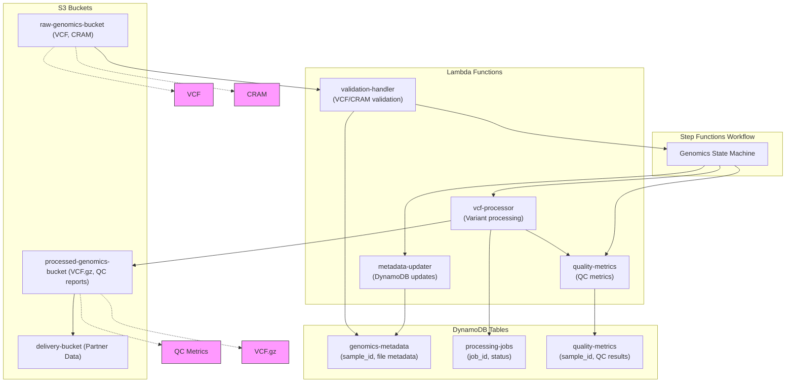

# Genomics Data Engineering Prototype

This project demonstrates a free-tier AWS genomics data engineering pipeline using Python, AWS CDK, Lambda, S3, Step Functions, and DynamoDB.

## 🗺️ Architecture Overview (Mermaid Diagram)

