# Senior Genomic Data Engineer Implementation Checklist

- [ ] **Infrastructure as Code**
	- [ ] Develop and maintain AWS CDK stacks (S3, Lambda, Step Functions, DynamoDB, IAM, networking)
	- [ ] Enforce security best practices (least privilege, encryption, VPC)
	- [ ] Implement lifecycle policies and cost controls

- [ ] **Pipeline Automation**
	- [ ] Build and optimize Lambda functions (validation, processing, QC metrics)
	- [ ] Integrate external tools (bcftools, samtools, GATK)
	- [ ] Design and implement Step Functions workflows (orchestration, error handling, retries)

- [ ] **Data Modeling & Management**
	- [ ] Design DynamoDB schemas (metadata, job tracking, QC results)
	- [ ] Implement efficient data access patterns and indexing

- [ ] **Testing & Quality Assurance**
	- [ ] Develop unit, integration, and end-to-end tests
	- [ ] Create mock services for local/CI testing
	- [ ] Set up automated test pipelines (GitHub Actions)

- [ ] **Monitoring, Logging & Cost Management**
	- [ ] Implement logging, monitoring, and alerting (CloudWatch, custom metrics)
	- [ ] Set up cost monitoring scripts and alerts
	- [ ] Regularly review and optimize resource usage

- [ ] **CI/CD & DevOps**
	- [ ] Automate deployment (scripts, GitHub Actions)
	- [ ] Implement rollback and approval mechanisms
	- [ ] Maintain environment configuration (dev, staging, prod)

- [ ] **Documentation & Training**
	- [ ] Maintain up-to-date documentation (README, diagrams, code comments)
	- [ ] Provide onboarding/training materials

- [ ] **Security & Compliance**
	- [ ] Ensure data privacy, access control, and compliance (e.g., HIPAA, GDPR)
	- [ ] Audit IAM policies and data access logs

- [ ] **Mentoring & Code Review**
	- [ ] Review code, enforce best practices, mentor team
	- [ ] Lead design and architecture reviews
# Genomics Data Engineering Prototype

This project demonstrates a free-tier AWS genomics data engineering pipeline using Python, AWS CDK, Lambda, S3, Step Functions, and DynamoDB.

## 🗺️ Architecture Overview (Mermaid Diagram)

```mermaid
flowchart TD

	UPL["Researchers<br>Lab Technicians<br>Bioinformaticians"]
	UI["Web UI / CLI / API"]
	SENG["<b>Senior Genomic Data Engineer</b><br>Designs, reviews, optimizes<br>all infrastructure & code"]

	%% Upstream Genomics Pipeline
	BCL["BCL (Sequencer Output)"]
	BCL2FQ["bcl2fastq / DRAGEN<br>(BCL→FASTQ)"]
	FQ["FASTQ (Raw Reads)"]
	ALIGN["BWA / Bowtie2 / STAR<br>(Alignment)"]
	BAM["BAM (Aligned Reads)"]
	CRAM["CRAM (Aligned Reads, Compressed)"]
	VARCALL["GATK / FreeBayes / DeepVariant<br>(Variant Calling)"]
	VCF["VCF (Variants)"]

	BCL --> BCL2FQ --> FQ
	FQ --> ALIGN --> BAM
	BAM --> CRAM
	BAM --> VARCALL
	CRAM --> VARCALL
	VARCALL --> VCF

	%% S3 Buckets
	subgraph S3["S3 Buckets"]
		RAW["raw-genomics-bucket<br>(BCL, FASTQ, BAM, CRAM, VCF)"]
		PROCESSED["processed-genomics-bucket<br>(VCF.gz, QC reports)"]
		DELIVERY["delivery-bucket<br>(Partner Data)"]
	end

	%% Uploads to S3
	UPL -->|"Upload BCL/FASTQ/BAM/CRAM/VCF"| UI
	UI -->|"Upload to S3"| RAW

	%% S3 stores all file types
	BCL --> RAW
	FQ --> RAW
	BAM --> RAW
	CRAM --> RAW
	VCF --> RAW


	subgraph Lambda["Lambda Functions"]
		VALIDATE["validation-handler<br>(VCF/CRAM validation)<br><br><b>Bioinformatics Engineers</b>"]
		PROCESS["vcf-processor<br>(Variant processing)<br><br><b>Bioinformaticians<br>Data Scientists</b>"]
		METRICS["quality-metrics<br>(QC metrics)<br><br><b>Bioinformaticians<br>Data Scientists</b>"]
		METAUPD["metadata-updater<br>(DynamoDB updates)<br><br><b>Data Stewards</b>"]
	end

	subgraph DDB["DynamoDB Tables"]
		META["genomics-metadata<br>(sample_id, file metadata)<br><br><b>Project Managers<br>Data Stewards<br>Researchers</b>"]
		JOBS["processing-jobs<br>(job_id, status)<br><br><b>Pipeline Operators<br>DevOps</b>"]
		QC["quality-metrics<br>(sample_id, QC results)<br><br><b>Bioinformaticians<br>Researchers</b>"]
	end

	subgraph SFN["Step Functions Workflow"]
		WORKFLOW["Genomics State Machine<br><br><b>Pipeline Operators<br>DevOps</b>"]
	end

	subgraph EXT["External"]
		PARTNERS["External Partners<br>Collaborators<br>Data Consumers"]
	end

	%% User Interactions

	UI -->|"Trigger Workflow"| WORKFLOW
	UI <-->|"View Results / Download"| DELIVERY
	UI <-->|"Check Status / QC"| META
	UI <-->|"Check Status / QC"| QC
	PARTNERS <-->|"Download Delivery Data"| DELIVERY

	%% Senior Genomic Data Engineer Interactions
	SENG -.-> RAW
	SENG -.-> PROCESSED
	SENG -.-> DELIVERY
	SENG -.-> VALIDATE
	SENG -.-> PROCESS
	SENG -.-> METRICS
	SENG -.-> METAUPD
	SENG -.-> META
	SENG -.-> JOBS
	SENG -.-> QC
	SENG -.-> WORKFLOW

	RAW --> VALIDATE
	VALIDATE --> META
	VALIDATE --> WORKFLOW
	WORKFLOW --> PROCESS
	PROCESS --> PROCESSED
	PROCESS --> JOBS
	PROCESS --> METRICS
	METRICS --> QC
	PROCESSED --> DELIVERY
	WORKFLOW --> METAUPD
	METAUPD --> META
	WORKFLOW --> METRICS

	%% Data Types (removed isolated VCF/CRAM nodes)
```

